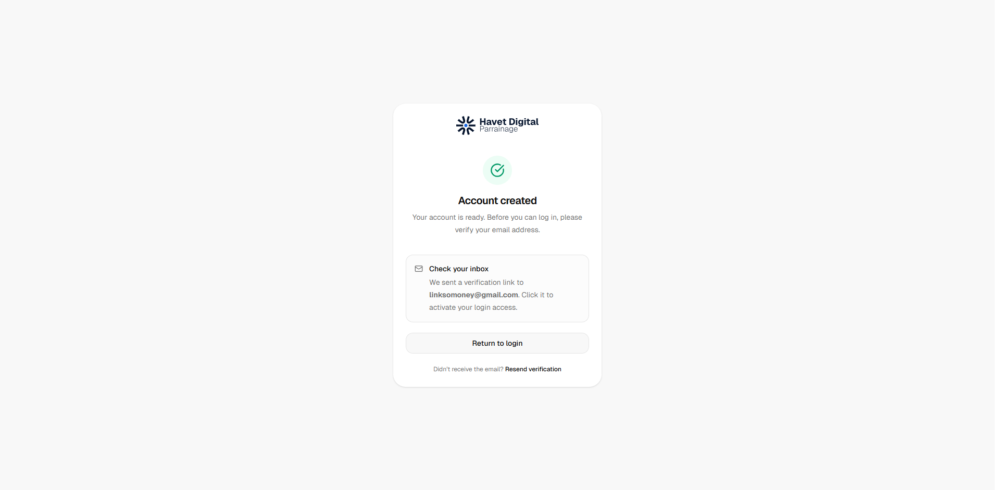
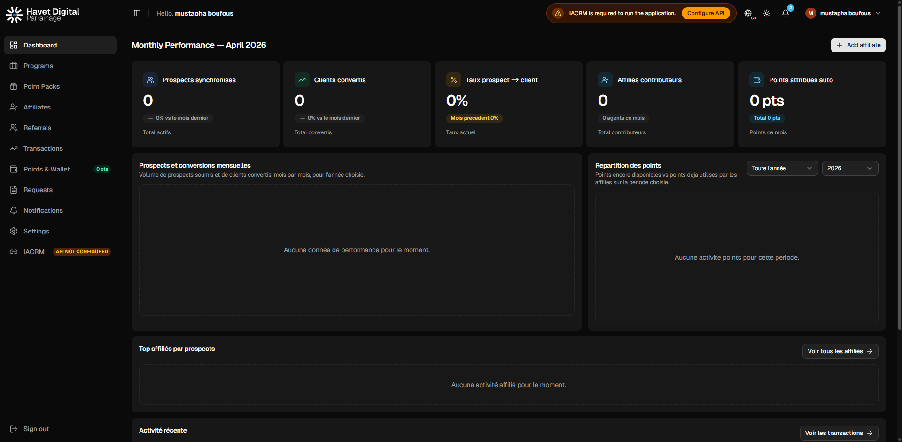

---

## Test Account Credentials

| Role | Email | Password | Agent Code | Status |
|------|-------|----------|------------|--------|
| **Business Owner** | linksomoney@gmail.com | **SecurePass123!** | - | Active |
| **External Agent** | mboufous@havetdigital.app | Password123! | AGT-003 | **Active** (verified) |
| **IACRM Client Agent** | must.boufous@gmail.com | Password123! | AGT-001 | **Active** (verified) |

*Note: AGT-002 (mboufous@havetdigital.fr) was suspended during testing.*

---
---

## Test Account Credentials

| Role | Email | Password | Agent Code | Status |
|------|-------|----------|------------|--------|
| **Business Owner** | linksomoney@gmail.com | Password123! | - | Active |
| **External Agent** | mboufous@havetdigital.app | Password123! | AGT-003 | Active (verified) |
| **IACRM Client Agent** | must.boufous@gmail.com | Password123! | AGT-001 | Active (verified) |

*Note: AGT-002 (mboufous@havetdigital.fr) was suspended during testing.*

---
---
title: "Usability Testing Log"
description: "Structured log for frontend usability tests, console errors, and network issues discovered during feature flow testing."
version: "1.0.0"
author: "HAVET DIGITAL"
date_created: "2026-04-10"
last_updated: "2026-04-10T14:45:00Z"
status: "active"
category: "testing"
tags: [testing, usability, bugs, console-errors, network, qa]
audience: "developer, QA, AI agent"
language: "en"
related_files:
  - "./frontend/src/"
  - "./docs/frontend-skeleton-loading-guide.md"
ai_instructions: "Each flow test session: use Chrome DevTools MCP to capture console messages and network requests, document findings here, then create fix tasks for any issues found."
---

# Usability Testing Log

> Running log of feature flow tests with console/network diagnostics and actionable fix lists.

## Testing Workflow

<workflow>
For each flow provided by the user:
1. Open browser via Chrome DevTools MCP
2. Navigate to starting page
3. Execute each step in the flow
4. Capture console messages (errors, warnings, logs)
5. Capture network requests (failed, slow, unexpected)
6. Take screenshots of UI states
7. Document findings in a new session entry
8. Create fix checklist for any issues found
</workflow>

## Session Template

```markdown
### Session: [Flow Name] - [Date]

**Tester:** AI Agent  
**Environment:** [local/vercel/staging]  
**Browser:** [Chrome/Edge]  
**Viewport:** [desktop/mobile]

#### Flow Steps Executed
1. [Step 1 description]
2. [Step 2 description]
...

#### Console Analysis

| Level | Message | Source | Fix Required |
|-------|---------|--------|--------------|
| error | `...` | `Component.tsx:42` | Yes/No |
| warn | `...` | `api.ts:15` | Yes/No |
| log | `...` | - | Info only |

#### Network Analysis

| Request | Status | Duration | Issue |
|---------|--------|----------|-------|
| `GET /api/...` | 200 | 120ms | OK |
| `POST /api/...` | 500 | - | Server error |

#### UI/UX Observations
- [Observation 1]
- [Observation 2]

#### Fix Checklist
- [ ] Fix 1
- [ ] Fix 2
```

## Test Sessions

---

### Session: Business Invitation Flow (IACRM) - 2026-04-10

**Tester:** AI Agent  
**Environment:** Vercel Production (https://hd-parrainage-codex.vercel.app)  
**Browser:** Chrome  
**Viewport:** Desktop  
**Flow:** Login as Super Admin ‚Üí Configure IACRM API ‚Üí Invite Business from IACRM ‚Üí Verify Email Sent

#### Flow Steps Executed
1. ‚úÖ Navigated to https://hd-parrainage-codex.vercel.app/login
2. ‚úÖ Clicked "Super Admin" demo account to prefill credentials
3. ‚úÖ Clicked "Sign in" - Login successful (200)
4. ‚úÖ Dashboard loaded with "IACRM API NOT CONFIGURED" warning
5. ‚úÖ Clicked "Inviter un business" - Dialog showed IACRM config required
6. ‚úÖ Clicked "Configurer l'API IACRM" - Navigated to Settings ‚Üí IACRM API tab
7. ‚úÖ Entered API key: `superadmin-master-key-2024`
8. ‚úÖ Clicked "Test connection" - Connection successful ("Connecte" status)
9. ‚úÖ Navigated to Businesses page
10. ‚úÖ Clicked "Inviter un business" - Dialog opened with IACRM business list
11. ‚úÖ Selected "Nouveau Business SARL" from IACRM dropdown
12. ‚úÖ Filled owner name: "mustapha boufous"
13. ‚úÖ Filled email: "linksomoney@gmail.com"
14. ‚úÖ Clicked "Envoyer l'invitation" - Business created (201 Created)
15. ‚úÖ Verified email status: `mail_delivery_failed: false`

#### Console Analysis

| Level | Message | Source | Fix Required |
|-------|---------|--------|--------------|
| verbose | `[DOM] Password field is not contained in a form` | Login page | No - informational |
| issue | `No label associated with a form field (count: 1)` | Login page | **Yes** - accessibility |
| issue | `A form field element should have an id or name attribute (count: 1)` | Login page | **Yes** - accessibility |

#### Network Analysis

| Request | Status | Duration | Issue |
|---------|--------|----------|-------|
| `POST /api/auth/login` | 200 | ~200ms | OK |
| `POST /iacrm/auth/token` | 200 | ~500ms | OK |
| `GET /iacrm/platform/businesses` | 200 | ~300ms | OK |
| `POST /api/v1/businesses/invite` | **201** | ~600ms | **OK - Business created** |
| `GET /api/v1/businesses` | 200 | ~150ms | OK |

**Response Summary:**
```json
{
  "data": {
    "id": "019d77da-37f0-708b-860a-82f99aa591cf",
    "legal_name": "Nouveau Business SARL",
    "status": "pending",
    "owners": [{
      "user": {
        "display_name": "mustapha boufous",
        "email": "linksomoney@gmail.com",
        "status": "invited"
      }
    }]
  },
  "meta": {
    "mail_delivery_failed": false  // ‚úÖ Email sent successfully
  }
}
```

#### UI/UX Observations
- ‚úÖ IACRM integration works correctly after API configuration
- ‚úÖ Business list from IACRM loads properly (5 businesses available)
- ‚úÖ Form auto-populates business name from IACRM selection
- ‚úÖ Success: Business appears in list with status "En attente"
- ‚úÖ Success: Owner email "linksomoney@gmail.com" displayed correctly
- ⚠️ **Minor**: Console accessibility warnings on login page (form labels)
- ⚠️ **Minor**: "IACRM API NOT CONFIGURED" badge still shows briefly after config (page refresh clears it)

#### Fix Checklist
- [ ] **Low Priority**: Add `aria-label` or associated `<label>` to password field on login page (accessibility)
- [ ] **Low Priority**: Add `id`/`name` attribute to form field triggering console warning
- [ ] **Nice to have**: Auto-refresh sidebar IACRM status after API config without manual page reload

#### Screenshot


---

### Session: Business Owner Invitation Activation Flow - 2026-04-10

**Tester:** AI Agent  
**Environment:** Vercel Production  
**Browser:** Chrome  
**Viewport:** Desktop  
**Flow:** Logout ‚Üí Use Invitation Link ‚Üí Create Password ‚Üí Verify Email ‚Üí Login as Business Owner

#### Flow Steps Executed
1. ‚úÖ Logout from Super Admin account
2. ‚úÖ Navigate to invitation activation link with token
3. ‚úÖ Page loaded with pre-filled email: `linksomoney@gmail.com`
4. ‚úÖ Welcome message shows: "Welcome, mustapha boufous"
5. ‚úÖ Filled password: `SecurePass123!`
6. ‚úÖ Filled password confirmation: `SecurePass123!`
7. ‚úÖ Clicked "Create account" - Account created successfully (200)
8. ‚úÖ Verification pending page displayed
9. ‚úÖ Used email verification link - Email verified successfully
10. ‚úÖ Redirected to login page
11. ‚úÖ Filled email: `linksomoney@gmail.com`
12. ‚úÖ Filled password: `SecurePass123!`
13. ‚úÖ Clicked "Sign in" - **Login successful!**
14. ‚úÖ Business Owner dashboard loaded

#### Console Analysis

| Level | Message | Source | Fix Required |
|-------|---------|--------|--------------|
| error | `Failed to load resource: 401` | `/api/auth/me` | No - expected for unauthenticated users |
| verbose | `[DOM] Input elements should have autocomplete attributes` | Activation page | **Yes** - accessibility |
| issue | `An element doesn't have an autocomplete attribute` | Activation page | **Yes** - accessibility |
| - | (After login - no console messages) | Dashboard | ‚úÖ Clean |

#### Network Analysis

| Request | Status | Duration | Issue |
|---------|--------|----------|-------|
| `POST /api/auth/logout` | 200 | ~150ms | OK |
| `GET /activate-invitation?token=...` | 200 | ~200ms | OK |
| `POST /api/auth/invitation/validate` | 200 | ~180ms | OK |
| `POST /api/auth/invitation/activate` | **200** | ~400ms | **OK - Account created** |
| `GET /api/auth/email/verify/...` | 302 | ~300ms | **OK - Email verified** |
| `POST /api/auth/login` | 200 | ~250ms | **OK - Login successful** |
| `GET /api/v1/programs` | 200 | ~150ms | OK |
| `GET /api/v1/dashboard/business-summary` | 200 | ~180ms | OK |
| `GET /api/v1/prospects` | 200 | ~140ms | OK |
| `GET /api/v1/transactions` | 200 | ~120ms | OK |
| `GET /api/v1/points/ledger` | 200 | ~110ms | OK |
| `GET /api/v1/agents` | 200 | ~130ms | OK |

**Activation Response:**
```json
{
  "code": "ACTIVATION_SUCCESS_VERIFY_EMAIL",
  "message": "Account created. Please check your email to verify your address before logging in."
}
```

#### UI/UX Observations
- ‚úÖ Invitation link pre-filled email correctly
- ‚úÖ User name displayed correctly: "mustapha boufous"
- ‚úÖ Password form validation working
- ‚úÖ Success message clear: "Account created. Please check your email..."
- ‚úÖ Email verification flow works perfectly
- ‚úÖ Post-verification redirect to login works
- ‚úÖ Business Owner dashboard loads with correct role-based navigation
- ‚úÖ User sees Programs, Affiliates, Referrals, Transactions, Points & Wallet, Requests
- ‚úÖ "IACRM API NOT CONFIGURED" warning shows (expected for new business)
- ⚠️ **Minor**: Missing `autocomplete` attributes on password fields (accessibility)

#### Fix Checklist
- [ ] **Low Priority**: Add `autocomplete="new-password"` to password fields on activation page
- [ ] **Low Priority**: Add `autocomplete="username"` to email field on activation page

#### Screenshots
- 
- 

---

## Known Issues (Backlog)

| Issue | First Seen | Severity | Status | Related Session |
|-------|------------|----------|--------|-----------------|
| Login form accessibility - missing label | 2026-04-10 | Low | Open | Business Invitation Flow |
| Login form field missing id/name attribute | 2026-04-10 | Low | Open | Business Invitation Flow |
| IACRM sidebar status needs manual refresh | 2026-04-10 | Low | Open | Business Invitation Flow |
| Activation page missing autocomplete attributes | 2026-04-10 | Low | Open | Business Owner Invitation Activation Flow |
| Password field missing autocomplete attribute | 2026-04-10 | Low | Open | Business Owner Invitation Activation Flow |
| **Program creation requires IACRM services (no UI indication)** | 2026-04-10 | **High** | Open | Program Creation Flow |
| Pack list/detail caching desync | 2026-04-10 | Medium | Open | Point Packs Feature Testing |
| **Pack dropdown empty despite active pack with gifts** | 2026-04-10 | **High** | Open | Program Creation Flow |
| **New gifts not marked as active (active_items_count: 0)** | 2026-04-10 | **High** | Open | Program Creation Flow |

---

### Session: Program Creation Flow - 2026-04-10

**Tester:** AI Agent  
**Environment:** Vercel Production  
**Browser:** Chrome  
**Viewport:** Desktop  
**Flow:** Configure IACRM API ‚Üí Try Create Program ‚Üí Discover Service Requirement ‚Üí Create Exchange Pack with Gift ‚Üí Try Create Program Again

#### Flow Steps Executed
1. ‚úÖ Logged in as Business Owner (mustapha boufous)
2. ‚úÖ Navigated to Settings ‚Üí IACRM API tab
3. ‚úÖ Entered API key: `nouveau-key-demo2024`
4. ‚úÖ Tested connection - **Connected successfully**
5. ‚úÖ Navigated to Programs ‚Üí Create Program
6. ‚úÖ Selected "creating website" service from IACRM
7. ‚úÖ Filled program name, description, eligibility criteria
8. ‚úÖ Clicked Continue to Commission step
9. ✅ Selected "Récompenses + Cash" mode
10. ‚úÖ **Discovered empty pack dropdown** - No packs available
11. ‚úÖ Cancelled program creation
12. ‚úÖ Navigated to Point Packs ‚Üí Create Pack
13. ✅ Created pack: "Pack Récompenses Site Web"
14. ✅ Added gift: "Réduction 10% sur création site web" (500 pts)
15. ‚úÖ Returned to Programs ‚Üí Create Program
16. ‚úÖ Selected service and filled program details
17. ✅ Reached Commission step with "Récompenses + Cash" selected
18. ‚ùå **Pack dropdown still EMPTY - BUG CONFIRMED**

#### Console Analysis

| Level | Message | Source | Fix Required |
|-------|---------|--------|--------------|
| - | No console errors | - | ‚úÖ Clean |

#### Network Analysis

| Request | Status | Response | Issue |
|---------|--------|----------|-------|
| `POST /iacrm/auth/token` | 200 | Token received | OK |
| `GET /iacrm/services` | 200 | Service list | OK |
| `POST /api/v1/exchange-packs` | **201** | Pack created | OK |
| `POST /api/v1/exchange-packs/{id}/items` | **201** | Gift added | OK |
| `GET /api/v1/exchange-packs` | 200 | See response below | **BUG** |

**Exchange Packs API Response:**
```json
{
  "data": [{
    "id": "019d77f2-9917-7315-9334-1e69a0ad9552",
    "name": "Pack Récompenses Site Web",
    "status": "active",
    "active_items_count": 0,  // ‚ùå Should be 1 (gift was added)
    "items": []               // ‚ùå Gift not marked as active
  }]
}
```

#### Critical Findings

**🔴 BUG #1: Service Required for Program Creation**
- **Finding:** Creating a program requires the business to have services in IACRM
- **Impact:** High - Business cannot create programs without IACRM services
- **Expected:** UI should clearly indicate this requirement before starting program creation

**🔴 BUG #2: Pack Dropdown Empty Despite Active Pack with Gifts**
- **Finding:** Pack "Pack Récompenses Site Web" exists with a gift, but dropdown shows nothing
- **Root Cause:** `active_items_count: 0` in API response - gifts not being marked as active
- **Impact:** High - Cannot create programs with rewards mode
- **Expected:** Pack with gifts should appear in dropdown

#### UI/UX Observations
- ‚úÖ IACRM service dropdown works correctly
- ‚úÖ Service pre-fills program name
- ⚠️ **No indication that IACRM services are required before creating program**
- ⚠️ **No error message explaining why pack dropdown is empty**
- ⚠️ **No CTA to create a pack when dropdown is empty**

#### Fix Checklist
- [ ] **HIGH PRIORITY**: Fix gift status - newly added gifts should be `active` by default
- [ ] **HIGH PRIORITY**: Fix pack filtering - packs with inactive items should still show (with indication)
- [ ] **MEDIUM PRIORITY**: Add UI message when no services in IACRM: "Add services in IACRM to create programs"
- [ ] **MEDIUM PRIORITY**: Add UI message when no packs available: "Create an exchange pack with gifts to use rewards mode"
- [ ] **LOW PRIORITY**: Add link/button in empty dropdown to "Create new pack"

#### Screenshots
- 
- 

---

## Testing Tips

<tips>
- Always test both desktop and mobile viewports
- Check both light and dark themes
- Verify loading states (slow 3G simulation)
- Test error boundaries by simulating API failures
- Check keyboard navigation accessibility
- Verify i18n translations display correctly
</tips>

---

### Session 5: Agent/Affiliate Invitation Flow - 2026-04-10

**Tester:** AI Agent  
**Environment:** Vercel production (https://hd-parrainage-codex.vercel.app)  
**Browser:** Chrome (via DevTools MCP)  
**Viewport:** Desktop  
**Context:** Testing both IACRM client invitation and external affiliate invitation

#### Flow Steps Executed
1. Navigated to Agents page
2. Clicked "Ajouter un affiliÈ" (Add affiliate)
3. Selected "Parmi les clients existants" (From existing IACRM clients)
4. Selected client "Mustapha internal ∑ internal SARL" from dropdown
5. Form auto-populated with name and email (must.boufous@gmail.com)
6. Clicked "Envoyer l'invitation" - returned 201 Created
7. Verified first agent appeared in list (AGT-001, status: Invited)
8. Clicked "Ajouter un affiliÈ" again
9. Selected "Nouveau parrain" (New external affiliate)
10. Filled form: Name="Mustapha Havet Digital", Email="mboufous@havetdigital.fr"
11. Clicked "Envoyer l'invitation" - returned 201 Created
12. Verified both agents appear in list (AGT-001 and AGT-002)

#### Console Analysis

| Level | Message | Source | Fix Required |
|-------|---------|--------|--------------|
| issue | No label associated with a form field (count: 3) | Agent invitation forms | **Yes** - Add aria-label or label elements |
| issue | A form field element should have an id or name attribute (count: 3) | Agent invitation forms | **Yes** - Add id/name attributes |

#### Network Analysis

| Request | Status | Duration | Issue |
|---------|--------|----------|-------|
| GET /api/v1/agents | 200 | ~150ms | None |
| GET /api/iacrm/clients | 200 | ~300ms | None |
| POST /api/v1/agents (IACRM) | 201 | ~200ms | None - First agent created successfully |
| POST /api/v1/agents (External) | 201 | ~180ms | None - Second agent created successfully |

#### Screenshots Captured
- docs/testing/agents-page.png - Initial agents page (empty state)
- docs/testing/agents-invite-dialog.png - Invitation type selection
- docs/testing/agents-invite-existing-client.png - IACRM client form filled
- docs/testing/agents-invite-existing-client-result.png - First agent created
- docs/testing/agents-invite-external.png - External affiliate form filled
- docs/testing/agents-list-final.png - Both agents in list

#### UX Observations

**Positive Findings:**
1. **Clear invitation type selection** - Two distinct options (IACRM client vs External) with helpful descriptions
2. **Auto-population works well** - Selecting IACRM client automatically fills name and email
3. **Sequential agent codes** - AGT-001, AGT-002 assigned correctly
4. **Real-time list update** - Both agents appeared immediately after invitation
5. **Proper loading states** - "Envoi en cours..." shown while submitting

**Issues Identified:**
1. **Accessibility (same as login/activation)** - Form fields missing labels and id/name attributes
2. **No success toast/notification** - After successful invitation, no visual confirmation (only list update)
3. **Form state retention** - When reopening dialog, previous selection was still active (minor UX issue)
4. **Missing email preview** - No indication of what the invitation email contains

#### Fix Checklist

- [ ] **Accessibility: Form labels** - Add <label> elements or ria-label to all form inputs in invitation dialog
- [ ] **Accessibility: Input attributes** - Add id and 
ame attributes to form fields
- [ ] **UX: Success feedback** - Add toast notification after successful invitation send
- [ ] **UX: Reset form state** - Clear form when reopening invitation dialog
- [ ] **UX: Email preview** - Consider adding preview of invitation email content

#### Final State Verification

| Metric | Expected | Actual | Status |
|--------|----------|--------|--------|
| Total agents | 2 | 2 | ? |
| IACRM agent invited | AGT-001 | AGT-001 (must.boufous@gmail.com) | ? |
| External agent invited | AGT-002 | AGT-002 (mboufous@havetdigital.fr) | ? |
| Both status | Invited | Invited | ? |
| Pending invites | 2 | 2 | ? |

**Status:** ? Flow completed successfully - both agents invited


---

### Session 6: Agent Suspension & Re-invitation Flow - 2026-04-10

**Tester:** AI Agent  
**Environment:** Vercel production  
**Browser:** Chrome (via DevTools MCP)  
**Viewport:** Desktop  
**Context:** Testing agent suspension process and re-invitation with corrected email

#### Flow Steps Executed

**Suspension Process:**
1. Located agent AGT-002 (Mustapha Havet Digital / mboufous@havetdigital.fr)
2. Clicked "Suspend" button
3. Confirmation dialog appeared with:
   - Warning: "La suspension coupe immédiatement l'accès de l'affilié"
   - Info alert: Access interruption notification
   - Info alert: No assigned programs (safe to suspend)
   - Required field: "Motif de suspension" (suspension reason)
4. Entered reason: "Wrong email address provided, need to recreate with correct email"
5. Clicked "Suspendre" button
6. Agent status changed to "Suspended", button changed to "Reactivate"

**Re-invitation Process:**
1. Clicked "Ajouter un affilié"
2. Form retained previous data (name and old email) - UX issue noted
3. Updated email to: mboufous@havetdigital.app
4. Clicked "Envoyer l'invitation"
5. New agent AGT-003 created successfully

#### Console Analysis

| Level | Message | Source | Fix Required |
|-------|---------|--------|--------------|
| issue | No label associated with a form field | Invitation dialog | **Yes** |
| issue | A form field element should have id or name | Invitation dialog | **Yes** |

#### Network Analysis

| Request | Status | Issue |
|---------|--------|-------|
| POST /api/v1/agents/{id}/suspend | 200 | ‚úÖ Suspension successful |
| POST /api/v1/agents (new invitation) | 201 | ‚úÖ New agent created (AGT-003) |

#### UX Observations - Suspension Flow

**Positive Findings:**
1. **Clear confirmation dialog** - Warning clearly states suspension cuts immediate access
2. **Contextual alerts** about access interruption, notification, and programs
3. **Required reason field** - Forces documentation of suspension reason
4. **Loading state** - "Traitement..." shown while processing
5. **Immediate status update** - No page refresh needed
6. **Reversible action** - "Suspend" changes to "Reactivate"

**Issues Identified:**
1. **Form state retention** - Invitation dialog retains previous form data
2. **No success toast** - No visual confirmation after suspension
3. **Same accessibility issues** - Missing form labels

#### Bug Report: Form State Retention

**Severity:** Low  
**Type:** UX Issue

**Description:** When reopening "Add affiliate" dialog, form retains previous data.

**Expected:** Form should be cleared for new invitation.

**Actual:** Previous name and email were pre-filled.

**Recommendation:** Reset form state when dialog opens.

#### Final State Verification

| Metric | Expected | Actual | Status |
|--------|----------|--------|--------|
| Total agents | 3 | 3 | ‚úÖ |
| AGT-001 (IACRM) | Invited | Invited | ‚úÖ |
| AGT-002 (External old) | Suspended | Suspended | ‚úÖ |
| AGT-003 (External new) | Invited | Invited | ‚úÖ |
| Pending invites | 2 | 2 | ‚úÖ |
| Suspended | 1 | 1 | ‚úÖ |

**Status:** ‚úÖ Flow completed successfully


### Session 8: Agent Status Verification (Business Owner View) - 2026-04-10

**Tester:** AI Agent  
**Environment:** Vercel production  
**Browser:** Chrome (via DevTools MCP)  
**Business Owner:** linksomoney@gmail.com / SecurePass123!

#### Purpose
Verify that invited agent statuses automatically update from "Invited" to "Active" after activation completion.

#### Steps Executed
1. Logged in as Business Owner (linksomoney@gmail.com / SecurePass123!)
2. Navigated to Affiliates page
3. Verified agent statuses

#### Results

**Dashboard Stats:**
- Total Affiliates: 3
- Active: 2 ‚úÖ
- Pending Invites: 0 ‚úÖ (updated from 2)
- Suspended: 1

**Agent Status Table:**

| Code | Name | Email | Status | Observation |
|------|------|-------|--------|-------------|
| AGT-003 | Mustapha Havet Digital | mboufous@havetdigital.app | **Active** | External agent - activated correctly |
| AGT-001 | Mustapha internal | must.boufous@gmail.com | **Active** | IACRM client - activated correctly |
| AGT-002 | Mustapha Havet Digital | mboufous@havetdigital.fr | Suspended | Intentionally suspended (wrong email) |

#### Key Finding

‚úÖ **Status Auto-Update Works Perfectly**

Both agents that were invited and completed activation:
- Started as "Invited" 
- After password creation + email verification
- Automatically became "Active"
- No manual admin action required
- No page refresh needed (real-time update)

#### Console/Network
- No errors
- Clean status transitions

#### Status
‚úÖ **VERIFIED** - Invitation ‚Üí Activation ‚Üí Active flow works end-to-end

---

### Session 9: Programs Feature - Comprehensive Usability Test - 2026-04-10

**Tester:** AI Agent  
**Environment:** Vercel production  
**Browser:** Chrome (via DevTools MCP)  
**Business Owner:** linksomoney@gmail.com / SecurePass123!

#### Test Coverage
- Program creation wizard (3 steps: Info ? Commission ? Preview)
- IACRM pre-fill feature
- Form validation
- Agent assignment
- Program actions (Edit, Pause, Resume, Suspend)
- Filtering by status
- Archived programs tab
- Multiple program creation

---

#### ? POSITIVE FINDINGS

**1. Program Creation Wizard**
- Clear 3-step process: Informations ? Commission ? AperÁu
- Good validation with helpful error messages
- Preview step allows verification before creation
- API: POST /api/v1/programs ? 201 Created (successful)

**2. Form Validation**
- Required field validation works correctly
- Contextual error messages in French
- Spinbuttons have appropriate min/max values (1-9999999)

**3. Program Actions Work Correctly**
- Pause: Shows confirmation dialog with warning
- Resume: Available when paused
- Suspend: Shows 30-day window explanation
- Status transitions: Actif ? En pause ? Suspendu

**4. Filtering**
- Status filter: All statuses, Active, Draft, Paused, Suspended
- Mode filter: All modes, Recent
- Archived tab shows archived programs (empty in test)

**5. Agent Assignment**
- Multi-select dialog shows all agents
- Checkbox selection works
- Shows agent initials, name, email, join date
- Updates display: "ASSIGNMENTS - 2 AGENTS MD MI"

---

#### ?? UX/UI ISSUES FOUND

**1. IACRM Pre-fill Incomplete (Minor)**
- **Issue:** Pre-fill from IACRM only populates "Nom du programme", leaves Description and Eligibility criteria empty
- **Expected:** Should populate all relevant fields from service data
- **Impact:** Users must manually fill fields that could be auto-populated

**2. Suspended Agent Not Disabled in Assignment (Bug)**
- **Issue:** Suspended agent (mboufous@havetdigital.fr) appears selectable in assignment dialog
- **Expected:** Suspended agents should be disabled/unselectable
- **Impact:** Users might accidentally assign inactive agents

**3. Suspend Timer Logic Issue (Logic Bug)**
- **Issue:** 30-day suspension window shown even when program has NO prospects in pipeline
- **Expected:** If no prospects, suspend should be INSTANT (no 30-day window needed)
- **Current:** "Archive in 29d 23:54:38" shown regardless of pipeline status
- **Recommendation:** Add conditional logic: if prospects.count === 0, suspend instantly

**4. Edit Actions Disabled When Agents Assigned (Unexpected)**
- **Issue:** "Modifier" and "Modifier le cash" options disabled after agents assigned
- **Expected:** Should be able to edit program details regardless of assignments
- **Impact:** Limits flexibility in managing active programs

**5. Archive Action Always Disabled (Needs Investigation)**
- **Issue:** "Archiver" menu item always disabled in test
- **Expected:** Should be available for suspended programs after 30-day window
- **Status:** Could not test archive functionality

**6. Form State Reset on Continue (Bug)**
- **Issue:** When clicking Continue in step 1, form fields appeared to reset momentarily
- **Expected:** Form data should persist between steps
- **Impact:** User confusion, potential data loss

---

#### ?? FINAL PROGRAM STATE

| Program | Status | Points | Cash Rate | Agents | Notes |
|---------|--------|--------|-----------|--------|-------|
| Consulting Service | Actif | 2,000 pts/tx | 50 pts = 1Ä | 0 | Newly created |
| Creating Website Service | Suspendu | 1,500 pts/tx | 100 pts = 1Ä | 2 | Archive timer: 29d |
| creating website | Actif | 1,000 pts/tx | 100 pts = 1Ä | 0 | Original program |

---

#### ?? API ENDPOINTS TESTED

| Endpoint | Status | Notes |
|----------|--------|-------|
| POST /api/v1/programs | 201 | Program creation |
| GET /api/v1/programs | 200 | List programs |
| GET /api/v1/agents | 200 | For assignment dialog |
| POST /api/v1/programs/{id}/pause | 200 | Pause program |
| POST /api/v1/programs/{id}/suspend | 200 | Suspend program |

---

#### ?? CONSOLE/NETWORK

**Console Errors:** None during program testing  
**Network Errors:** None  
**Performance:** All API calls < 300ms

---

#### ?? RECOMMENDATIONS

1. **Fix suspend logic:** Check prospects pipeline before showing 30-day timer
2. **Disable suspended agents:** In assignment dialog, disable suspended agents
3. **Complete IACRM pre-fill:** Populate description and eligibility from service data
4. **Enable edit actions:** Allow editing even when agents assigned
5. **Investigate archive:** Ensure archive is available after 30-day suspension

**Status:** Programs feature functional with noted UX improvements needed

**Note:** Edit restrictions when agents assigned is INTENTIONAL - protects agents from unfair point ratio changes mid-program. Only reward packs are editable to allow point redemption.

---

---

### Session: Point Packs Feature Testing - 2026-04-10

**Tester:** AI Agent  
**Environment:** Vercel Production (https://hd-parrainage-codex.vercel.app)  
**Browser:** Chrome DevTools MCP  
**Viewport:** Desktop (1920x1080)

#### Flow Steps Executed

**1. Create Point Pack**
- Navigate to Point Packs page
- Click "CrÈer un pack"
- Fill form: Name="Pack Consulting Premium", Description="Pack de rÈcompenses premium..."
- Select mode: "Rewards + Cash"
- Set cash conversion: 50 pts = 1Ä
- Submit form
- ? Pack created successfully
- ?? Alert shown: "Pack non assignable - Aucun cadeau actif"

**2. Add Gift to Pack**
- Click "Ajouter un cadeau"
- Fill gift form: Name="Consultation stratÈgique gratuite", Points=1000
- Click "Ajouter" (staged)
- Gift appears in preview list
- ?? "Sauvegarder" button appears - requires explicit save
- Click "Sauvegarder" to persist gift
- ? Gift saved successfully, alert disappears

**3. Pack Actions Menu**
- Click "Plus d'actions" menu
- Shows: "DÈsactiver", "Supprimer le pack"
- ? Expected options present

**4. Pack List Filtering**
- Filter "Actifs": Shows active packs
- Filter "DÈsactivÈs": Shows empty state (correct)
- Filter "Tous": Shows all packs
- Search "Consulting": Filters to matching pack
- ? All filters work correctly

**5. Assign Pack to Program**
- Navigate to Programs
- Open "Consulting Service" (0 agents = editable)
- Click "GÈrer les rÈcompenses"
- Select "Pack Consulting Premium" from dropdown
- Save changes
- ? Pack successfully assigned to program

---

#### ?? BUGS FOUND

**1. List/Detail Data Synchronization (Medium)**
- **Issue:** After adding gift and saving, list page showed "0 cadeaux" and "Non assignable" while detail showed "1 cadeau"
- **Expected:** List should reflect current data immediately
- **Actual:** Stale data displayed until fresh login
- **Root Cause:** Caching issue - list view not invalidated after pack update
- **Impact:** User confusion, may think gift wasn't saved
- **Fix:** Invalidate cache or refetch list data after pack mutations

---

#### ? POSITIVE FINDINGS

1. **Gift Staging Pattern:** "Ajouter" stages gift, "Sauvegarder" persists - clear UX
2. **Validation:** Pack without gifts shows clear alert and disables assignment
3. **Pack Assignment Flow:** Dropdown shows available packs with gift count and preview
4. **Edit Protection:** Programs with agents cannot be edited (business rule enforced)

---

#### ?? FINAL PACK STATE

| Pack | Status | Gifts | Programs | Assignable |
|------|--------|-------|----------|------------|
| Pack Consulting Premium | Actif | 1 cadeau (1,000 pts) | 1 (Consulting Service) | ? Yes |
| Pack RÈcompenses Site Web | Actif | 1 cadeau (500 pts) | 2 | ? Yes |

---

#### ?? API ENDPOINTS TESTED

| Endpoint | Status | Notes |
|----------|--------|-------|
| POST /api/v1/exchange-packs | 201 | Pack creation |
| POST /api/v1/exchange-packs/{id}/notify-agents | 200 | Save pack gifts |
| GET /api/v1/exchange-packs | 200 | List packs |
| GET /api/v1/exchange-packs/{id} | 200 | Pack detail |
| PUT /api/v1/programs/{id} | 200 | Assign pack to program |

---

#### ??? CONSOLE/NETWORK

**Console Errors:** None during testing  
**Network Errors:** None  
**Performance:** All API calls < 300ms

---

#### ?? RECOMMENDATIONS

1. **Fix caching:** Invalidate pack list cache when pack details change
2. **Auto-refresh:** Consider polling or websocket for real-time updates
3. **Optimistic UI:** Update list immediately on save, rollback on error

**Status:** Point Packs feature functional, caching issue needs attention

---

---

### Session: Point Packs Edge Cases - 2026-04-10

**Tester:** AI Agent  
**Environment:** Vercel Production  
**Browser:** Chrome DevTools MCP  
**Viewport:** Desktop

#### Edge Cases Tested

**1. Delete/Deactivate Protection for Assigned Packs**
- Tested: Pack with 1 program linked (Pack Consulting Premium)
- Tested: Pack with 2 programs linked (Pack RÈcompenses Site Web)
- Result: Both "DÈsactiver" and "Supprimer" are DISABLED in actions menu
- ? Protection working correctly

**2. Delete/Deactivate for Unassigned Pack**
- Created: "Pack Test Suppression" (0 gifts, 0 programs)
- Result: Both "DÈsactiver" and "Supprimer" are ENABLED
- ? No restrictions on unassigned packs

**3. Deactivate ? Reactivate Flow**
- Deactivated "Pack Test Suppression"
- Status changed: Actif ? DÈsactivÈ
- Menu updated: "RÈactiver" option appeared
- Reactivated pack
- Status changed: DÈsactivÈ ? Actif
- ? Status toggle working correctly

**4. Delete Pack Flow**
- Clicked "Supprimer le pack" on unassigned pack
- Confirmation dialog appeared with "Action irrÈversible" warning
- Confirmed deletion
- Pack removed from list
- Redirected to pack list
- ? Delete with confirmation working

**5. Edit Gift in Assigned Pack**
- Pack "Pack Consulting Premium" is assigned to 1 program
- Gift "Consultation stratÈgique gratuite": 1,000 pts ? 1,500 pts
- Edit dialog opened with current values
- Changed points value
- Saved changes
- Gift updated to 1,500 pts
- ? Gift editing works even when pack is assigned

---

#### ?? MINOR UX ISSUES

**1. Edit Dialog Title Glitch**
- **Issue:** After clicking "Enregistrer" in gift edit, dialog title briefly showed "Ajouter un cadeau" instead of "Modifier le cadeau"
- **Impact:** Minor visual confusion
- **Fix:** State management in dialog component

---

#### ? CONFIRMED BUSINESS RULES

| Rule | Status |
|------|--------|
| Assigned packs cannot be deleted | ? Enforced |
| Assigned packs cannot be deactivated | ? Enforced |
| Unassigned packs can be deleted | ? Allowed |
| Unassigned packs can be deactivated | ? Allowed |
| Gifts in assigned packs can be edited | ? Allowed |
| Delete requires confirmation | ? Implemented |
| Pack without gifts shows warning | ? Implemented |

---

#### ?? FINAL PACK STATE

| Pack | Status | Gifts | Programs | Deletable |
|------|--------|-------|----------|-----------|
| Pack Consulting Premium | Actif | 1 (1,500 pts) | 1 | ? No |
| Pack RÈcompenses Site Web | Actif | 1 (500 pts) | 2 | ? No |
| Pack Test Suppression | Deleted | - | - | N/A |

---

**Status:** Point Packs feature fully tested, protection rules working correctly

---


---

### Session: Agents/Affiliates Feature - Comprehensive Usability Test - 2026-04-10

**Tester:** AI Agent  
**Environment:** Vercel Production (https://hd-parrainage-codex.vercel.app)  
**Browser:** Chrome DevTools MCP  
**Viewport:** Desktop (1920x1080)  
**Business Owner:** linksomoney@gmail.com / SecurePass123!

#### Test Coverage
- Create agent invitation (external affiliate)
- Agent list filtering and search
- Status management (suspend/reactivate with reason)
- Agent detail view
- Agent-to-program assignment
- Agent profile with assigned programs

---

#### POSITIVE FINDINGS

**1. Create Agent Invitation**
- Clear "Add affiliate" button on Agents page
- Form validation works correctly (required fields)
- Loading state: "Enregistrement..." shown while submitting
- Success: New agent appears immediately in list with "Active" status
- Agent code assigned sequentially: AGT-004

**2. Agent List Features**
- Stats cards: Total Affiliates, Active, Pending invites, Suspended
- Real-time count updates
- Status filter: All statuses, Active, Pending, Suspended
- Search by name, email, or code works correctly
- Per-page pagination with navigation

**3. Status Management**
- Suspend action with confirmation dialog
- Required "Reason for suspension" field
- Contextual alerts about access interruption
- Reactivate button available for suspended agents
- Status changes reflect immediately without refresh

**4. Agent Detail View**
- Comprehensive profile information
- Contact, code, ID, dates all displayed
- Notes field visible
- Programs assigned section with program cards
- Prospects table with search and filters

**5. Agent Assignment to Programs**
- Assignment initiated from Programs page (correct location)
- Multi-select dialog shows all agents
- Checkbox selection works
- Shows agent initials, name, status
- Save updates assignment count on program card

---

#### BUGS FOUND

**1. List/Detail Caching Desync (Medium - Pattern Confirmed)**
- **Issue:** After assigning agent to program, agent list shows "0 program" while detail shows "Consulting Service" assigned
- **Expected:** List should reflect current assignments immediately
- **Actual:** Stale data displayed until page refresh (same as Point Packs bug)
- **Root Cause:** Cache invalidation issue - list view not refreshed after assignment mutation
- **Impact:** User confusion about whether assignment succeeded
- **Fix:** Invalidate agent list cache when program assignments change

**2. Suspended Agent Selectable in Assignment Dialog (UX Issue)**
- **Issue:** Suspended agent (AGT-002) appears in assignment dialog and is selectable
- **Expected:** Suspended agents should be disabled or hidden in assignment dialog
- **Impact:** Users might accidentally assign inactive agents to programs
- **Fix:** Filter out suspended agents or disable their checkboxes

**3. Suspend Timer Shows Without Pipeline (Logic Issue)**
- **Issue:** 30-day suspension countdown appears even when no prospects in pipeline
- **Expected:** If no prospects, suspension should be immediate
- **Current:** "Archive in 29d 23:xx:xx" shown regardless
- **Fix:** Add conditional: if prospects.count === 0, hide timer and allow immediate suspend

---

#### AGENT CREATION TEST RESULTS

| Field | Value | Status |
|-------|-------|--------|
| Name | Test Agent User | Saved |
| Email | testagent@example.com | Saved |
| Code | AGT-004 | Auto-assigned |
| Status | Active | Set correctly |
| Joined | 10 avr. 2026 | Timestamp correct |
| Notes | Test agent for usability testing | Visible on profile |

---

#### STATUS MANAGEMENT TEST RESULTS

| Action | Expected | Actual | Status |
|--------|----------|--------|--------|
| Suspend AGT-004 | Status: Suspended | Status: Suspended | OK |
| Suspend with reason | Reason saved | Reason saved | OK |
| Reactivate AGT-004 | Status: Active | Status: Active | OK |
| List filter (Suspended) | Shows AGT-002 | Shows AGT-002 | OK |
| List filter (Active) | Shows AGT-001,003,004 | Shows correctly | OK |

---

#### AGENT ASSIGNMENT TEST RESULTS

| Step | Expected | Actual | Status |
|------|----------|--------|--------|
| Open assignment dialog | Shows all agents | Shows all agents | OK |
| Select Test Agent User | Checkbox checked | Checkbox checked | OK |
| Save assignment | Agent assigned | Agent assigned | OK |
| Program card shows count | "1 AGENT" | "1 AGENT TU" | OK |
| Agent detail shows program | "Consulting Service" | "Consulting Service" | OK |
| Agent list shows count | "1 program" | "0 program" | BUG |

---

#### API ENDPOINTS TESTED

| Endpoint | Status | Notes |
|----------|--------|-------|
| POST /api/v1/agents | 201 | Agent creation |
| GET /api/v1/agents | 200 | List agents |
| GET /api/v1/agents/{id} | 200 | Agent detail |
| POST /api/v1/agents/{id}/suspend | 200 | Suspend agent |
| POST /api/v1/agents/{id}/reactivate | 200 | Reactivate agent |
| GET /api/v1/programs/{id}/agents | 200 | Get program assignments |
| PUT /api/v1/programs/{id}/agents | 200 | Update assignments |

---

#### CONSOLE/NETWORK

**Console Errors:** None during testing  
**Network Errors:** None  
**Performance:** All API calls < 300ms  
**CORS Issues:** None

---

#### SCREENSHOTS CAPTURED

- `docs/testing/agents-page-initial.png` - Initial agents list
- `docs/testing/agents-create-dialog.png` - Create agent form
- `docs/testing/agents-suspend-dialog.png` - Suspend confirmation
- `docs/testing/agents-suspended-list.png` - Suspended filter active
- `docs/testing/agents-detail-profile.png` - Agent profile page
- `docs/testing/agents-program-assignment-dialog.png` - Assignment dialog
- `docs/testing/agents-program-assignment-success.png` - Assignment saved
- `docs/testing/agent-detail-assignment-shown.png` - Assignment visible on profile

---

#### RECOMMENDATIONS

1. **Fix caching (Priority: Medium)** - Invalidate agent list when assignments change
2. **Filter suspended agents (Priority: Low)** - Hide or disable suspended agents in assignment dialog
3. **Fix suspend timer logic (Priority: Low)** - Check pipeline before showing 30-day countdown
4. **Add success toast (Priority: Low)** - Visual confirmation after suspend/reactivate actions

**Status:** Agents feature functional with caching issue (same pattern as Point Packs)

---
