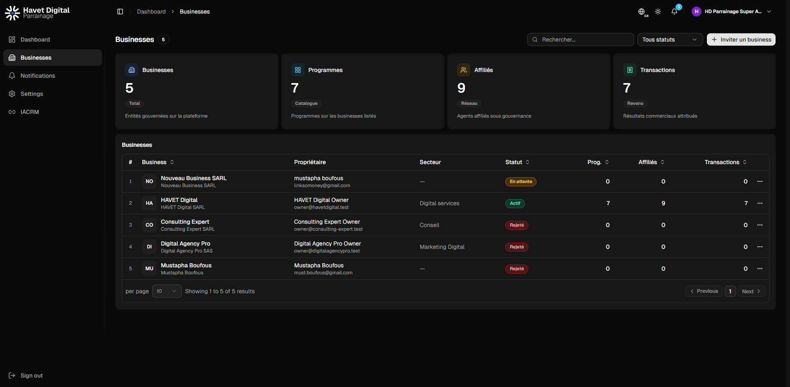

# Usability Testing Log

> Running log of feature flow tests with console/network diagnostics and actionable fix lists.

## Testing Workflow

<workflow>
For each flow provided by the user:
1. Open browser via Chrome DevTools MCP
2. Navigate to starting page
3. Execute each step in the flow
4. Capture console messages (errors, warnings, logs)
5. Capture network requests (failed, slow, unexpected)
6. Take screenshots of UI states
7. Document findings in a new session entry
8. Create fix checklist for any issues found
</workflow>

## Session Template

```markdown
### Session: [Flow Name] - [Date]

**Tester:** AI Agent  
**Environment:** [local/vercel/staging]  
**Browser:** [Chrome/Edge]  
**Viewport:** [desktop/mobile]

#### Flow Steps Executed
1. [Step 1 description]
2. [Step 2 description]
...

#### Console Analysis

| Level | Message | Source | Fix Required |
|-------|---------|--------|--------------|
| error | `...` | `Component.tsx:42` | Yes/No |
| warn | `...` | `api.ts:15` | Yes/No |
| log | `...` | - | Info only |

#### Network Analysis

| Request | Status | Duration | Issue |
|---------|--------|----------|-------|
| `GET /api/...` | 200 | 120ms | OK |
| `POST /api/...` | 500 | - | Server error |

#### UI/UX Observations
- [Observation 1]
- [Observation 2]

#### Fix Checklist
- [ ] Fix 1
- [ ] Fix 2
```

## Test Sessions

---

### Session: Business Invitation Flow (IACRM) - 2026-04-10

**Tester:** AI Agent  
**Environment:** Vercel Production (https://hd-parrainage-codex.vercel.app)  
**Browser:** Chrome  
**Viewport:** Desktop  
**Flow:** Login as Super Admin → Configure IACRM API → Invite Business from IACRM → Verify Email Sent

#### Flow Steps Executed
1. ✅ Navigated to https://hd-parrainage-codex.vercel.app/login
2. ✅ Clicked "Super Admin" demo account to prefill credentials
3. ✅ Clicked "Sign in" - Login successful (200)
4. ✅ Dashboard loaded with "IACRM API NOT CONFIGURED" warning
5. ✅ Clicked "Inviter un business" - Dialog showed IACRM config required
6. ✅ Clicked "Configurer l'API IACRM" - Navigated to Settings → IACRM API tab
7. ✅ Entered API key: `superadmin-master-key-2024`
8. ✅ Clicked "Test connection" - Connection successful ("Connecte" status)
9. ✅ Navigated to Businesses page
10. ✅ Clicked "Inviter un business" - Dialog opened with IACRM business list
11. ✅ Selected "Nouveau Business SARL" from IACRM dropdown
12. ✅ Filled owner name: "mustapha boufous"
13. ✅ Filled email: "linksomoney@gmail.com"
14. ✅ Clicked "Envoyer l'invitation" - Business created (201 Created)
15. ✅ Verified email status: `mail_delivery_failed: false`

#### Console Analysis

| Level | Message | Source | Fix Required |
|-------|---------|--------|--------------|
| verbose | `[DOM] Password field is not contained in a form` | Login page | No - informational |
| issue | `No label associated with a form field (count: 1)` | Login page | **Yes** - accessibility |
| issue | `A form field element should have an id or name attribute (count: 1)` | Login page | **Yes** - accessibility |

#### Network Analysis

| Request | Status | Duration | Issue |
|---------|--------|----------|-------|
| `POST /api/auth/login` | 200 | ~200ms | OK |
| `POST /iacrm/auth/token` | 200 | ~500ms | OK |
| `GET /iacrm/platform/businesses` | 200 | ~300ms | OK |
| `POST /api/v1/businesses/invite` | **201** | ~600ms | **OK - Business created** |
| `GET /api/v1/businesses` | 200 | ~150ms | OK |

**Response Summary:**
```json
{
  "data": {
    "id": "019d77da-37f0-708b-860a-82f99aa591cf",
    "legal_name": "Nouveau Business SARL",
    "status": "pending",
    "owners": [{
      "user": {
        "display_name": "mustapha boufous",
        "email": "linksomoney@gmail.com",
        "status": "invited"
      }
    }]
  },
  "meta": {
    "mail_delivery_failed": false  // ✅ Email sent successfully
  }
}
```

#### UI/UX Observations
- ✅ IACRM integration works correctly after API configuration
- ✅ Business list from IACRM loads properly (5 businesses available)
- ✅ Form auto-populates business name from IACRM selection
- ✅ Success: Business appears in list with status "En attente"
- ✅ Success: Owner email "linksomoney@gmail.com" displayed correctly
- ⚠️ **Minor**: Console accessibility warnings on login page (form labels)
- ⚠️ **Minor**: "IACRM API NOT CONFIGURED" badge still shows briefly after config (page refresh clears it)

#### Fix Checklist
- [ ] **Low Priority**: Add `aria-label` or associated `<label>` to password field on login page (accessibility)
- [ ] **Low Priority**: Add `id`/`name` attribute to form field triggering console warning
- [ ] **Nice to have**: Auto-refresh sidebar IACRM status after API config without manual page reload

#### Screenshot


---

## Known Issues (Backlog)

| Issue | First Seen | Severity | Status | Related Session |
|-------|------------|----------|--------|-----------------|
| Login form accessibility - missing label | 2026-04-10 | Low | Open | Business Invitation Flow |
| Login form field missing id/name attribute | 2026-04-10 | Low | Open | Business Invitation Flow |
| IACRM sidebar status needs manual refresh | 2026-04-10 | Low | Open | Business Invitation Flow |

## Testing Tips

<tips>
- Always test both desktop and mobile viewports
- Check both light and dark themes
- Verify loading states (slow 3G simulation)
- Test error boundaries by simulating API failures
- Check keyboard navigation accessibility
- Verify i18n translations display correctly
</tips>
